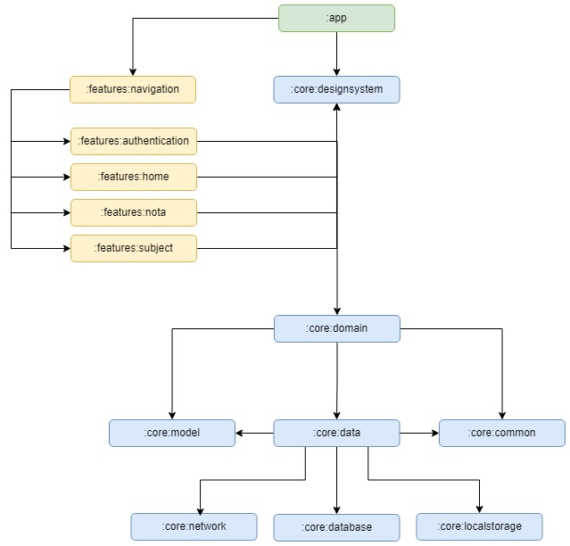

## Tech stacks & Libs

- Minimum SDK 26
- Kotlin with Coroutines + Flow
- Jetpack
  - Lifecycle
  - ViewModel
  - Compose
  - Hilt
  - Room(soon)
- Architecture
  - MVVM Architecture
  - Clean Architecture Pattern
- Firebase
  - Auth
  - Storage
  - Database
- Coil Compose
- Material 3

## App Modularization

## Version Management
- This repo is using the [Android Version Bump](https://github.com/marketplace/actions/android-version-bump) action to use semantic commits and automatically bumping major, minor o patch versions.

### Bump Version Workflow
- To bump **Major**:
    - use `major` as commit tag
        - `major: drop support for api v21`
    - use `BREAKING CHANGE` or `!` in commit body
    - Using the above convention, then the major version will be bumped. Ex: 1.0.0 -> 2.0.0

- To bump **Minor**:
    - use `feat` or `minor` as commit tag
    - then the minor version will get bumped (1.0.0 -> 1.1.0)

- To bump **Patch**
  - any other change will generate 1.0.0 to 1.0.1

